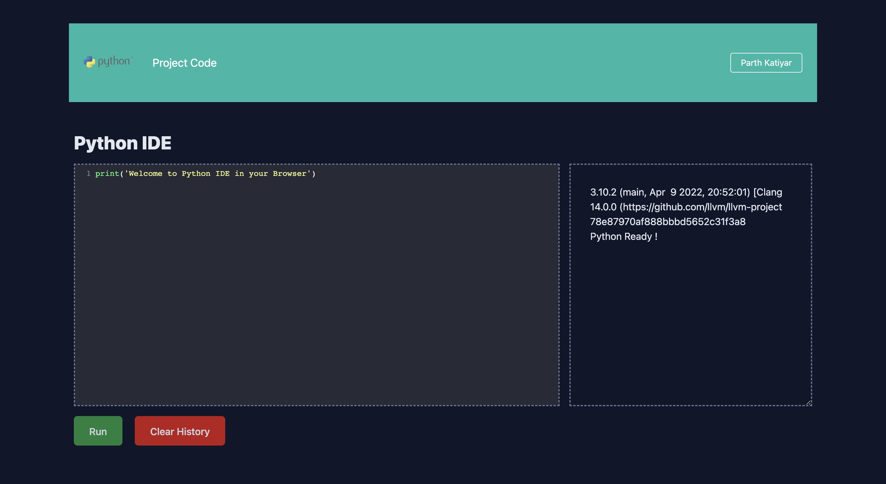

# <strong>WebAssembly Python IDE</strong>

### <italic>
[Visit Link](https://wasm-python-ide.herokuapp.com)
<italic>

Web Assembly Based Python IDE Enviornment which runs natively in the client's browser.

